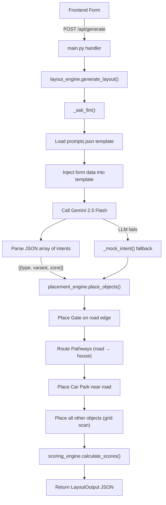
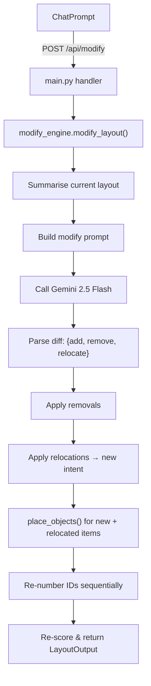

# AI Landscape Designer 3D — Backend Walkthrough

## Tech Stack

| Layer | Choice |
|-------|--------|
| Framework | **FastAPI** (async Python) |
| Server | **Uvicorn** with `--reload` for dev |
| Validation | **Pydantic v2** (BaseModel schemas) |
| AI / LLM | **Gemini 2.5 Flash** via `google-genai` SDK |
| Config | `python-dotenv` → `.env` for `GEMINI_API_KEY` |

---

## Directory Structure

```
backend/
├── server.py                           # Uvicorn entry (python server.py)
├── requirements.txt                    # fastapi, uvicorn, pydantic, python-dotenv, google-genai
├── .env                                # GEMINI_API_KEY=...
│
└── app/
    ├── __init__.py
    ├── main.py                         # FastAPI app, CORS, route handlers
    │
    ├── models/                         # Pydantic schemas
    │   ├── input_schema.py             # LandscapeDesignInput (request body)
    │   ├── layout_schema.py            # LayoutOutput (response body)
    │   └── modify_schema.py            # ModifyDesignInput (modify request)
    │
    ├── services/                       # Business logic
    │   ├── layout_engine.py            # Orchestrator: LLM → placement → scoring
    │   ├── placement_engine.py         # Local constraint-aware coordinate solver
    │   ├── scoring_engine.py           # Vastu / sustainability / cooling / utilization
    │   ├── vastu_engine.py             # Vastu Shastra guideline generator
    │   ├── modify_engine.py            # Natural-language layout modifier
    │   ├── llm_service.py              # Legacy Gemini wrapper (test endpoints only)
    │   └── constraint_solver.py        # Post-hoc overlap/bounds validator (legacy)
    │
    └── data/                           # Static data files
        ├── feature_catalog.json        # Master catalog: feature types + variants + dimensions
        ├── prompts.json                # LLM system/user prompt templates + available_items
        └── last_llm_request.json       # Debug dump of last Gemini call
```

---

## Data Flow

### Generate Flow (`POST /api/generate`)



### Modify Flow (`POST /api/modify`)



---

## API Endpoints

| Method | Path | Input Schema | Output Schema | Purpose |
|--------|------|-------------|---------------|---------|
| POST | `/api/generate` | `LandscapeDesignInput` | `LayoutOutput` | Generate a new layout from scratch |
| POST | `/api/modify` | `ModifyDesignInput` | `LayoutOutput` | Modify existing layout via natural language |
| POST | `/api/test-llm` | `LandscapeDesignInput` | `{response: str}` | Test raw Gemini response (debug) |
| GET | `/api/test-llm-direct` | `?prompt=...` | `{response: str}` | Direct Gemini connectivity test |

---

## Pydantic Schemas

### Input: [input_schema.py](file:///d:/Programming/AI/ai-landscape-designer-3d/backend/app/models/input_schema.py)

```python
LandscapeDesignInput
├── land: LandInput              # width, depth, unit ("m"/"ft")
├── house: HouseInput            # x, y, width, depth, rotation
├── car_park: CarParkInput?      # width, depth, type ("open"/"covered")
├── road_direction: Literal      # "north" | "south" | "east" | "west"
├── vastu_priority: int          # 0–10
├── vehicle_count: int           # 0–4
├── optional_features: Dict      # {"bench": 2, "trees": 3, ...}
├── ground_texture: Literal      # "grass" | "stone_paving" | "bare_earth" | "mixed"
└── wall_texture: Literal        # "brick" | "concrete"
```

**Validators:** `house` and `car_park` are validated to fit within `land` dimensions.

### Output: [layout_schema.py](file:///d:/Programming/AI/ai-landscape-designer-3d/backend/app/models/layout_schema.py)

```python
LayoutOutput
├── land: LandOutput             # Echoes input + road_direction, textures
├── house: HouseOutput           # x, y, width, depth, rotation
├── car_park: CarParkOutput?     # x, y, width, depth, type, rotation
├── gate: GateOutput?            # id, variant, x, y, width, depth, rotation
├── zones: [ZoneOutput]          # 9 compass zones (N, S, E, W, NE, NW, SE, SW, Center)
├── objects: [ObjectOutput]      # Placed landscape features
├── pathways: [PathwayOutput]    # Routed point-based pathways
├── unplaced: [UnplacedOutput]   # Failed placements with reasons
├── scores: ScoresOutput         # 4 scores (0–100 each)
└── recommendations: [str]       # Human-readable summary lines
```

**ObjectOutput fields:** `id`, `type`, `variant`, `x`, `y`, `width`, `depth`, `height`, `rotation`, `zoneId`, `render_type` (`"model"` | `"flat"` | `"path"`), `material`

### Modify: [modify_schema.py](file:///d:/Programming/AI/ai-landscape-designer-3d/backend/app/models/modify_schema.py)

```python
ModifyDesignInput
├── current_layout: LayoutOutput       # Full existing layout
├── user_prompt: str                   # Natural language instruction (1–1000 chars)
└── input_data: LandscapeDesignInput   # Original form data (for placement constraints)
```

---

## Service Engines

### layout_engine.py — Orchestrator (330 lines)

The central coordinator for layout generation.

**Key functions:**

| Function | Purpose |
|----------|---------|
| `generate_layout()` | Main entry: LLM → placement → scoring |
| `_ask_llm()` | Builds prompt from template, calls Gemini, parses intent array |
| `_mock_intent()` | Deterministic fallback when LLM fails |
| `_build_available_items_text()` | Filters `prompts.json` catalog to only requested feature types |
| `_build_catalog_map()` | Flattens `feature_catalog.json` → `{variant_id: {width, depth, height, render_type, material}}` |
| `_build_zones()` | Generates the 9 compass zones as rectangles |
| `_fallback_layout()` | Returns empty layout with error message |
| `_save_last_request()` | Dumps prompt to `last_llm_request.json` for debugging |

**LLM interaction:**
- Model: `gemini-2.5-flash`
- Prompt template loaded from `prompts.json` → `intent_prompt_template`
- Placeholders replaced: `{width}`, `{depth}`, `{house_x}`, `{vastu_hint}`, `{available_items}`, etc.
- Response: JSON array of `[{type, variant, zone, rotation}]`
- Markdown fence stripping: handles `` ```json `` wrappers
- On failure: falls back to `_mock_intent()` with hardcoded variant→zone mapping

### placement_engine.py — Coordinate Solver (480 lines)

The heaviest service. Converts abstract `{type, variant, zone}` intents into exact `(x, y)` coordinates with collision avoidance.

**Placement order (critical for avoiding deadlocks):**

```
1. Gate       → Snapped to road-facing boundary edge, aligned with house center
2. Pathways   → Routed from gate/road to house entrance (L-shaped if needed)
3. Car Park   → Near road side, rotated to face gate, with driveway clearance
4. Everything → Grid-scanned within preferred zone, then fallback zones
```

**Core algorithm — `_try_place()`:**
- Scans the zone in a 0.5m grid pattern
- Direction-aware: east zones scan right→left, north zones scan top→bottom
- Each candidate `(x, y)` is checked against:
  - House rectangle (always blocked)
  - Car park rectangle (if placed)
  - All previously placed objects (`placed_rects` list)
- 0.5m minimum spacing (`SPACING`) enforced via inflated bounding boxes
- Returns first valid position or `None`

**Car park placement — `_place_car_park()`:**
- Preferred zones based on road direction (e.g. south road → `south_east`, `south_west`)
- LLM-suggested zone gets priority if valid
- Rotation swaps width/depth for 90°/270° orientations
- After placement, adds a **clearance corridor** from car park to road edge (prevents objects blocking vehicle access)

**Pathway routing — `_route_pathway()`:**
- Routes from gate center (or road edge) to house entrance
- House entrance = center of road-facing wall
- Creates L-shaped waypoints if start and end aren't aligned
- Pathway segments are added to `placed_rects` to prevent overlaps

**Zone bounds:**
9 named zones → axis-aligned bounding boxes. `"center"` uses the inner 60% of the land.

### scoring_engine.py — Layout Quality Scores (86 lines)

Calculates four 0–100 scores post-placement.

| Score | Formula | Details |
|-------|---------|---------|
| **Vastu** | `(priority × 10) + placement_bonus` | Bonus = % of objects in Vastu-preferred zones × 30 |
| **Sustainability** | `green_ratio × 200` | 50% green coverage = 100. Floor at 20. Green types: trees, bush, flowers, veggie beds, pond, fountain, well |
| **Cooling** | `cool_ratio × 250 − solar_penalty` | Cool types: trees, pond, fountain, bush, well. Penalty: +10 if road faces south/east |
| **Space Utilization** | `used_area / land_area × 100` | Sum of house + car park + objects + 50% pathway length |

**Vastu-preferred zones:**

| Feature | Preferred Zones |
|---------|----------------|
| trees | north, north_east, east |
| pond / fountain / well | north, north_east |
| bench | east, north_east |
| flower_beds | east, west, north |
| garden_lights | south_east |

### vastu_engine.py — Guideline Generator (18 lines)

Returns Vastu Shastra placement hints based on priority level:

| Priority | Guidelines |
|----------|------------|
| ≤ 3 (Low) | "Apply basic logical layout. No strict Vastu constraints." |
| 4–7 (Medium) | Water features → North/East. Green spaces → North/East. Clear road→house access. |
| ≥ 8 (High) | **STRICT**: Water MUST be N/NE. No heavy structures in exact NE corner. South/West road → parking in SE or NW. |

### modify_engine.py — Natural Language Modifier (254 lines)

Handles conversational design iteration via `POST /api/modify`.

**Steps:**
1. `_summarise_current_layout()` — Compact text summary of all objects, pathways, car park, gate
2. `_build_modify_prompt()` — Instructs Gemini to return `{add: [], remove: [], relocate: []}`
3. Call Gemini → parse diff JSON
4. Apply removals (filter by ID)
5. Apply relocations (convert to new placement intents)
6. `place_objects()` for new + relocated items (with existing objects as obstacles)
7. Re-number all IDs sequentially (`obj_001`, `obj_002`, ...)
8. Re-score and return

**LLM diff format:**
```json
{
  "add": [{"type": "bench", "variant": "bench_wood_01", "zone": "east"}],
  "remove": ["obj_003", "path_001"],
  "relocate": [{"id": "obj_002", "zone": "west"}]
}
```

**Safety rules in prompt:**
- Gate and Car Park are **permanent** (not added/removed unless explicitly requested)
- Conservative: only change what the user asked for
- House is never included in output

### constraint_solver.py — Post-hoc Validator (65 lines)

> [!NOTE]
> This is a **legacy module** — not currently called in the main pipeline. The placement engine now handles collision avoidance directly during placement.

Provides `validate_and_correct_layout()` which:
- Removes objects outside land bounds
- Removes objects overlapping the house
- Removes objects overlapping each other
- Moves violations to the `unplaced` list with reasons

### llm_service.py — Legacy LLM Wrapper (102 lines)

> [!NOTE]
> This module is only used by the **test endpoints** (`/api/test-llm`, `/api/test-llm-direct`). The main generate flow uses `layout_engine._ask_llm()` directly.

Provides `get_gemini_response()` (full prompt) and `test_gemini_direct()` (raw prompt).

---

## Data Files

### [feature_catalog.json](file:///d:/Programming/AI/ai-landscape-designer-3d/backend/app/data/feature_catalog.json)

Master catalog of all placeable features. Used by the placement engine for dimensions.

**Structure:**
```json
{
  "features": [
    {
      "type": "bench",
      "variants": [
        { "id": "bench_wood_01", "width": 3.0, "depth": 1.4, "height": 1.2, "render_type": "model", "material": null },
        { "id": "bench_stone_01", ... }
      ]
    },
    ...
  ]
}
```

**Current feature types:** bench, pond, fountain, trees, flower_beds, bush, pathway, well, vegetable_beds, garden_lights, gate, car_park

> [!IMPORTANT]
> This file **must stay in sync** with the frontend `featureCatalog.js`. A mismatch causes "Variant not in catalog" unplaced errors.

### [prompts.json](file:///d:/Programming/AI/ai-landscape-designer-3d/backend/app/data/prompts.json)

Contains:
- `system_prompt` — Legacy system instruction
- `user_prompt_template` — Legacy user prompt (used by test endpoint)
- `intent_system_prompt` — System instruction for the intent flow
- `intent_prompt_template` — Template with `{placeholders}` for the generate flow
- `available_items` — Compact variant catalog passed to the LLM (type + variants with id/width/depth)

The `intent_prompt_template` contains ~40 placement rules covering:
- Variant ID constraints
- Car park/gate/driveway positioning
- Pathway separation from driveways
- Vastu zone preferences
- Object placement heuristics (benches near paths, trees at boundaries, etc.)

### last_llm_request.json

Auto-generated debug file. Contains the exact `system_instruction` and `contents` sent to Gemini on the last API call. Useful for prompt debugging.

---

## Key Design Decisions

1. **LLM provides intent, not coordinates.** Gemini only decides *what* goes *where* (zone-level). The local `placement_engine` handles exact positioning with collision avoidance. This makes the system robust to LLM hallucinations.

2. **Fallback to mock intent.** If Gemini fails (quota, network, parse error), `_mock_intent()` provides a deterministic layout so the user never sees a blank screen.

3. **Placement order matters.** Gate → Pathways → Car Park → Objects. Earlier items reserve space (via `placed_rects`) so later items can't overlap them. Car park adds a clearance corridor to the road.

4. **Zone-based grid scan.** Objects prefer their LLM-assigned zone, but fall back through all 9 zones if the preferred zone is full. This guarantees placement unless the land is truly exhausted.

5. **Rotation-aware bounding boxes.** 90°/270° rotations swap width↔depth for collision detection, so rotated objects still fit correctly.

6. **Scoring is fully local.** No LLM call needed — scores are computed from object positions, types, and Vastu zone membership.

---

## Running the Backend

```bash
cd backend
pip install -r requirements.txt        # fastapi, uvicorn, pydantic, python-dotenv, google-genai
python server.py                       # Starts on http://127.0.0.1:8000 with hot reload
```

Requires `GEMINI_API_KEY` in `.env`.
