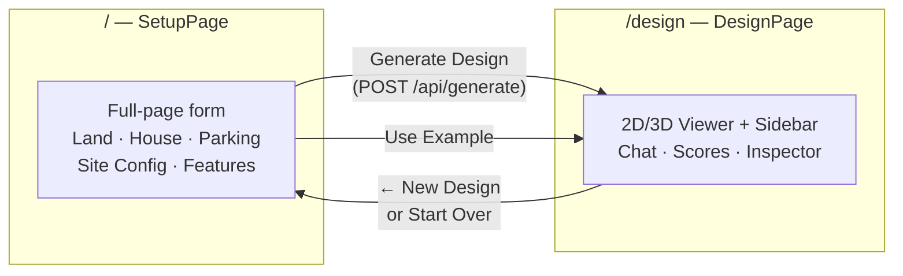
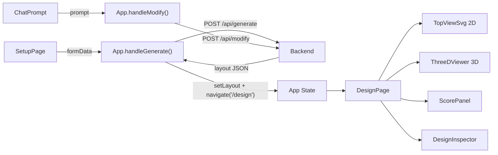
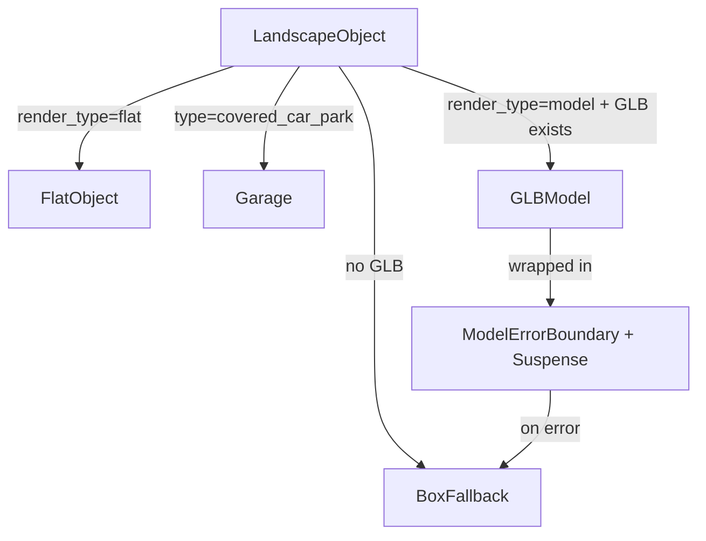

# AI Landscape Designer 3D — Frontend Walkthrough

## Tech Stack

| Layer | Choice |
|-------|--------|
| Framework | **React 19** (Vite 8, `@vitejs/plugin-react`) |
| 3D Engine | **Three.js 0.184** via `@react-three/fiber` 9 + `@react-three/drei` 10 |
| HTTP Client | **Axios** → `http://localhost:8000/api` |
| Routing | **react-router-dom 7** — two-page flow: Setup (`/`) → Design (`/design`) |
| Styling | Vanilla CSS (`index.css`, ~1180 lines, dark glassmorphism theme) |

---

## Directory Structure

```
frontend/src/
├── main.jsx                      # ReactDOM entry — StrictMode + BrowserRouter + App
├── App.jsx                       # Router hub — shared state + route definitions
├── App.css                       # Minimal (67 B, mostly unused)
├── index.css                     # Full design system (~1180 lines)
│
├── api/
│   └── landscapeApi.js           # Axios wrappers: generate + modify
│
├── pages/
│   ├── SetupPage.jsx             # ✅ Full-page config form (land, house, features)
│   └── DesignPage.jsx            # ✅ Viewer page (2D/3D/Walk + sidebar inspector)
│
├── constants/
│   ├── renderConfig.js           # Heights, colors, ground, lift constants
│   └── texturePaths.js           # Ground/surface/wall/road texture maps
│
├── data/
│   ├── featureCatalog.js         # FEATURES list, colors, MODEL_PATHS, OBJECT_DIMENSIONS
│   └── exampleLayout.json        # Hard-coded sample layout (5 objects, 1 pathway)
│
├── hooks/
│   └── useSceneTexture.js        # Safe texture loader (graceful fallback on 404)
│
├── components/
│   ├── ChatPrompt.jsx            # Modification prompt bar (bottom of viewer)
│   ├── ScorePanel.jsx            # Vastu/Sustainability/Cooling/Space score bars
│   ├── ThreeDLayout.jsx          # ⚠️ LEGACY — standalone 3D, NOT imported
│   ├── TopViewSvg.jsx            # ⚠️ LEGACY — old 2D view, NOT imported
│   ├── LayoutForm.jsx            # ⚠️ LEGACY — old sidebar form (replaced by SetupPage)
│   │
│   ├── sidebar/
│   │   ├── LayoutForm.jsx        # ⚠️ LEGACY — sidebar form (logic now in SetupPage)
│   │   ├── DesignInspector.jsx   # Post-generation: texture/variant/object inspector
│   │   └── ObjectInspector.jsx   # Standalone inspector (unused — folded into DesignInspector)
│   │
│   ├── viewer2d/
│   │   └── TopViewSvg.jsx        # ✅ ACTIVE 2D SVG renderer (selection, clicking)
│   │
│   └── viewer3d/
│       ├── index.jsx             # ✅ ACTIVE Canvas + scene composition
│       ├── controls/
│       │   └── WalkControls.jsx  # FPS walk: pointer lock, WASD, collision, sprint
│       ├── objects/
│       │   ├── LandscapeObject.jsx  # Dispatcher: flat → FlatObject, model → GLBModel
│       │   ├── GLBModel.jsx         # Auto-scaling .glb loader
│       │   ├── FlatObject.jsx       # Textured box for lawns, ponds, driveways
│       │   ├── PathwayMesh.jsx      # Segmented pathway + auto light poles
│       │   ├── LightPole.jsx        # Procedural lamp post with point light
│       │   └── ModelErrorBoundary.jsx  # React error boundary for GLB failures
│       └── scene/
│           ├── Ground.jsx           # Textured ground plane (module-level cache)
│           ├── BoundaryWall.jsx     # Perimeter wall: brick/concrete, gate, pillars
│           ├── House.jsx            # Procedural house: walls, pitched roof, windows
│           ├── Garage.jsx           # Covered car park: bays, doors, shed roof
│           ├── Road.jsx             # Asphalt road with direction label
│           ├── LandBoundary.jsx     # Plot slab + glow border
│           └── Compass.jsx          # 3D north arrow
```

---

## Page Flow & Routing



### Route Definitions (App.jsx)

| Path | Component | Condition |
|------|-----------|-----------|
| `/` | `SetupPage` | Shown when `layout === null`. Redirects to `/design` if layout exists. |
| `/design` | `DesignPage` | Shown when `layout !== null`. Redirects to `/` if no layout. |

---

## Data Flow



### Layout JSON Shape

```json
{
  "land": { "width": 20, "depth": 30, "unit": "m", "road_direction": "south", "ground_texture": "grass" },
  "house": { "x": 5, "y": 8, "width": 10, "depth": 9 },
  "zones": [{ "id": "north", "type": "north", "x": 0, "y": 15, "width": 20, "depth": 15 }],
  "objects": [{
    "id": "obj_004", "type": "bench", "variant": "bench_wood_01",
    "x": 10, "y": 23, "width": 2, "depth": 1, "height": 0.6,
    "rotation": 0, "zoneId": "north_east",
    "render_type": "model",
    "material": null
  }],
  "pathways": [{ "id": "path_001", "variant": "path_stone_01", "points": [[10,0],[10,8]], "width": 1.2, "material": "stone" }],
  "car_park": { "x": "...", "y": "...", "width": "...", "depth": "...", "type": "open|covered", "rotation": 0 },
  "gate": { "x": "...", "y": "...", "width": 4, "depth": 0.2 },
  "unplaced": [{ "type": "car_park", "reason": "Variant not in catalog." }],
  "scores": { "vastuScore": 65, "sustainabilityScore": 24, "coolingScore": 20, "spaceUtilizationScore": 28 },
  "recommendations": ["Vastu priority 5/10 applied."]
}
```

---

## Key Components in Detail

### App.jsx (Router Hub — ~90 lines)

Owns **shared state** that persists across page navigation:

| Variable | Purpose |
|----------|---------|
| `layout` | Current generated/modified layout JSON |
| `isLoading` | Loading spinner during API calls |
| `error` | Error message string (shown as toast) |
| `lastFormData` | Cached form data for `/api/modify` context |

Defines **handlers** passed to both pages:
- `handleGenerate(formData)` — calls API, sets layout, navigates to `/design`
- `handleUseExample()` — loads `exampleLayout.json`, navigates to `/design`
- `handleModify(prompt)` — calls modify API, updates layout in place
- `handleStartOver()` — clears layout, navigates back to `/`

### SetupPage.jsx (Full-page Setup — ~210 lines)

Beautiful full-page configuration form with a card-based grid layout. Replaces the old sidebar `LayoutForm`.

**Layout**: Hero header → 3-column card grid → 2-column card grid → Action buttons

**Cards:**
| Card | Contents |
|------|----------|
| 📐 Land Dimensions | Width × Depth inputs |
| 🏠 House Placement | X, Y position + Width, Depth |
| 🚗 Parking | Type dropdown (open/covered) + Vehicle count |
| ⚙️ Site Configuration | Road direction, ground texture, wall texture, Vastu priority slider |
| 🌳 Landscape Features | Checkbox + quantity for 9 feature types |

**Actions:**
- **Generate Design** button — calls `onGenerate`, shows full-page loading overlay during API call
- **"or try with example layout"** link — calls `onUseExample`

**Loading state**: Full-screen overlay with blur + spinner + "Gemini is crafting a Vastu-aware layout…"

### DesignPage.jsx (Viewer Page — ~220 lines)

The design viewer, extracted from the original monolithic `App.jsx`. Owns all viewer-specific state:

| Variable | Purpose |
|----------|---------|
| `activeTab` | `'2d'` / `'3d'` / `'walk'` |
| `has3dMounted` | Lazy-mount flag — 3D Canvas stays alive once opened |
| `selectedId` | Currently selected object ID (shared between 2D & sidebar) |
| `walkMode` | FPS walk mode toggle |
| `isPointerLocked` | Tracks browser pointer lock state |

**Layout**: Header (with "← New Design" button) → Sidebar (DesignInspector) + Viewer area

**Key design decisions:**
- 3D viewer uses `visibility: hidden` (not `display: none`) to keep WebGL context alive
- Walk mode uses Pointer Lock API with a "click to capture" overlay
- HUD hint auto-fades after 4 seconds
- Sidebar always shows `DesignInspector` (no LayoutForm — that's on SetupPage now)

### DesignInspector.jsx (Post-generation sidebar — 153 lines)

Shows on the design page sidebar. Two modes:
1. **No selection**: lists all objects with clickable rows
2. **Object selected**: shows variant picker (for models) or material picker (for flat objects)

Also exposes ground texture and wall texture dropdowns + "Start Over" button.

### viewer3d/index.jsx (3D Canvas — 153 lines)

Scene composition:
- Lighting: ambient (0.4) + directional shadow-casting + point light + hemisphere
- Controls: `OrbitControls` (orbit mode) or `WalkControls` (FPS mode)
- Scene elements: Ground → LandBoundary → BoundaryWall → Road → Grid → Pathways → Objects → CarPark → House → Compass
- `onPointerMissed` deselects current object

### WalkControls.jsx (FPS — 257 lines)

- Pointer Lock API for mouse capture
- WASD + arrows for movement, Shift for sprint (2.2× speed)
- AABB collision against house, covered car parks, and tall objects
- Wall-sliding collision resolution (try X-only, then Z-only, then block)
- Eye height locked at ground + 1.7m
- Teleports player to safe start position on mount

### Object Rendering Pipeline



### BoundaryWall.jsx (358 lines — largest component)

- Renders 4 perimeter walls (N/S/E/W)
- Road-facing wall gets a **SplitWall** with gate opening
- Other walls are **SolidWall** (continuous)
- **Pillars** at all 4 corners + flanking the gate
- **GateModel**: loads `/models/gate/gate.glb`, auto-scaled to opening width
- Wall texture driven by `land.wall_texture` (`brick` or `concrete`)
- Uses `@react-three/drei`'s `useTexture` hook with tiling

---

## Texture System

| Category | Config File | Texture Directory | Used By |
|----------|------------|-------------------|---------|
| Ground | `GROUND_TEXTURES` | `/textures/ground/` | `Ground.jsx` |
| Surface/Material | `SURFACE_TEXTURES` | `/textures/surface/` + `/textures/ground/` | `FlatObject.jsx` |
| Wall | `WALL_TEXTURES` | `/textures/` | `BoundaryWall.jsx` |
| Road | `ROAD_TEXTURES` | `/textures/road/` | `Road.jsx` |
| House | Hard-coded paths | `/textures/wall_texture.jpg`, `/textures/roof_texture.jpg` | `House.jsx` |

**Texture loading strategy:**
- `Ground.jsx`: Module-level cache (`textureCache{}`) — texture survives re-renders/tab switches
- `FlatObject.jsx`: Uses `useSceneTexture` hook (per-instance, graceful 404 fallback)
- `BoundaryWall.jsx`: Uses drei's `useTexture` + manual `.clone()` for tiling
- `Road.jsx`: Uses `useSceneTexture` hook

---

## Model Catalog

16 GLB models registered in `MODEL_PATHS`:

| Key | Path |
|-----|------|
| `bench_wood_01` | `/models/bench/bench_wood_01.glb` |
| `bench_stone_01` | `/models/bench/bench_stone_01.glb` |
| `pond_small_01` | `/models/pond/pond_small_01.glb` |
| `tree_palm_01` | `/models/trees/tree_palm_01.glb` |
| `maple_tree` | `/models/trees/maple_tree.glb` |
| `pine_tree` | `/models/trees/pine_tree.glb` |
| `psx_birch_tree` | `/models/trees/psx_birch_tree.glb` |
| `oak_tree` | `/models/trees/oak_tree.glb` |
| `car_park_open_01` | `/models/car_park/car_park_open_01.glb` |
| `flower_bed_rect_01/02` | `/models/flower_beds/...` |
| `flower_bed_round_01` | `/models/flower_beds/...` |
| `fountain_round_01` | `/models/fountain/...` |
| `path_stone_01` | `/models/decor/path_stone_01.glb` |
| `well_01` | `/models/well/stone_well_stylized.glb` |
| `bush_01` | `/models/bush/small_bush.glb` |
| `empty_garden` | `/models/vegetable_beds/empty_garden.glb` |
| `vegetable_beds_1` | `/models/vegetable_beds/vegetable_beds_1.glb` |
| `gate` | `/models/gate/gate.glb` |
| `garden_light_pole` | `/models/light/light_pole.glb` |

---

## CSS Design System (index.css — ~1180 lines)

- **Theme**: Dark mode with glassmorphism (backdrop-filter blur)
- **Color palette**: Green accent (`#63be7b`), Sky (`#38bdf8`), Amber (`#f59e0b`), Red (`#f87171`)
- **Layout**: Flexbox shell — header + (sidebar | viewer-area) on DesignPage
- **Setup page**: Card-based responsive grid (3-col → 2-col → 1-col), hero section with radial glow, loading overlay
- **Animations**: `slideUp` (error toast), `spin` (loading), `pulseIcon` (walk capture), `walkHudFade` (4s hint), `logoPulse` (setup hero)
- **Responsive**: Setup cards reflow at 900px/640px; DesignPage sidebar stacks at 768px

> [!NOTE]
> There are several **legacy files** that are NOT actively imported:
> - [ThreeDLayout.jsx](file:///d:/Programming/AI/ai-landscape-designer-3d/frontend/src/components/ThreeDLayout.jsx) (old monolithic 3D)
> - [TopViewSvg.jsx](file:///d:/Programming/AI/ai-landscape-designer-3d/frontend/src/components/TopViewSvg.jsx) (old 2D without selection)
> - [sidebar/LayoutForm.jsx](file:///d:/Programming/AI/ai-landscape-designer-3d/frontend/src/components/sidebar/LayoutForm.jsx) (old sidebar form — logic moved to SetupPage)
> - [ObjectInspector.jsx](file:///d:/Programming/AI/ai-landscape-designer-3d/frontend/src/components/sidebar/ObjectInspector.jsx) (folded into DesignInspector)
>
> The active versions are in `pages/`, `viewer2d/`, and `viewer3d/` subdirectories.
